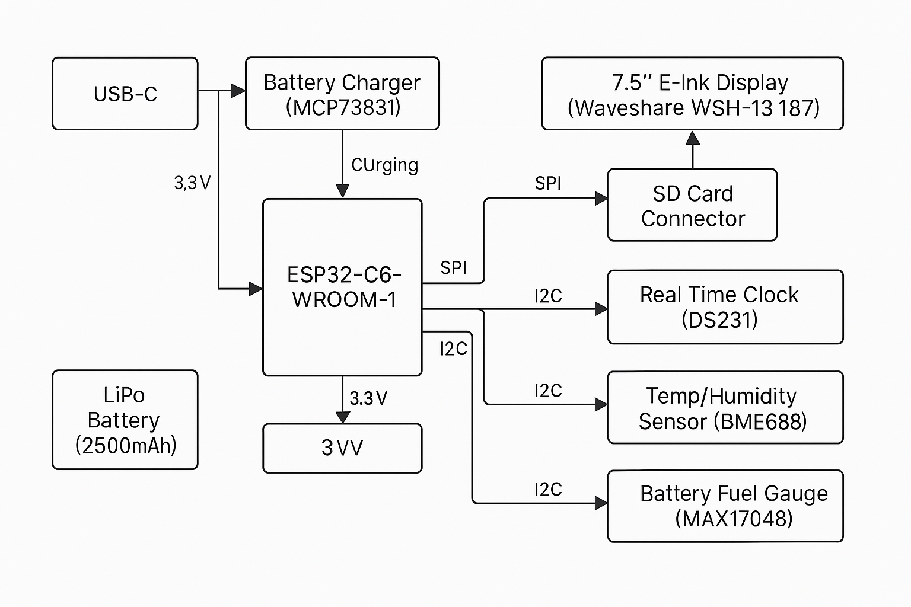

# DeskAssistant v15 – ESP32-C6 Smart E-Ink Device

## 🔧 Diagrama bloc

---

## 📦 Bill of Materials (BOM)

| Componentă | Link Mouser | Link Comet | Datasheet |
|------------|-------------|------------|-----------|
| ESP32-C6-WROOM-1 | [Mouser](https://www.mouser.com/ProductDetail/356-ESP32C6WRM1) | [Comet](https://www.comet.bg/en/products/44639/) | [Datasheet ESP32-C6](https://www.espressif.com/sites/default/files/documentation/esp32-c6_datasheet_en.pdf) |
| BME688 | [Mouser](https://www.mouser.com/ProductDetail/Bosch-Sensortec/BME688) | [Comet](https://www.comet.bg/en/products/43883/) | [Datasheet BME688](https://www.bosch-sensortec.com/media/boschsensortec/downloads/datasheets/bst-bme688-ds001.pdf) |
| MAX17048 | [Mouser](https://www.mouser.com/ProductDetail/Maxim-Integrated/MAX17048G+) | [Comet](https://www.comet.bg/en/products/40714/) | [Datasheet MAX17048](https://datasheets.maximintegrated.com/en/ds/MAX17048-MAX17049.pdf) |
| MCP73831 (Battery Charger) | [Mouser](https://www.mouser.com/ProductDetail/Microchip-Technology/MCP73831T-2ACIOT) | [Comet](https://www.comet.bg/en/products/43632/) | [Datasheet MCP73831](https://ww1.microchip.com/downloads/en/DeviceDoc/20001984g.pdf) |
| DS3231 RTC | [Mouser](https://www.mouser.com/ProductDetail/Maxim-Integrated/DS3231SN) | [Comet](https://www.comet.bg/en/products/38983/) | [Datasheet DS3231](https://datasheets.maximintegrated.com/en/ds/DS3231.pdf) |
| 7.5" E-Ink Display (WSH-13187) | [Mouser](https://www.mouser.com/ProductDetail/Waveshare/WSH-13187) | [Comet](https://www.comet.bg/en/products/45670/) | [Datasheet E-Ink](https://www.waveshare.com/w/upload/0/09/7.5inch-e-paper-b-specification.pdf) |
| LDO 3.3V | [Mouser](https://www.mouser.com/ProductDetail/Texas-Instruments/LP2985AIM5-33) | [Comet](https://www.comet.bg/en/products/43540/) | [Datasheet LDO](https://www.ti.com/lit/ds/symlink/lp2985.pdf) |
| SD Card Socket | [Mouser](https://www.mouser.com/ProductDetail/Amphenol/101-00594-68) | [Comet](https://www.comet.bg/en/products/37655/) | [Datasheet Socket](https://cdn.amphenol-icc.com/media/wysiwyg/files/drawing/10100594681.pdf) |
| LiPo Battery 2500mAh | [Mouser](https://www.mouser.com/ProductDetail/Adafruit/328) | [Comet](https://www.comet.bg/en/products/37491/) | [Specificații](https://cdn-shop.adafruit.com/datasheets/328.pdf) |

---

## 🧠 Funcționalitate Hardware

DeskAssistant v15 este un dispozitiv portabil cu ecran E-Ink, destinat afișării de informații de mediu, oră și nivel baterie. Este alimentat fie prin USB-C, fie dintr-o baterie LiPo de 2500 mAh.

### Flux de alimentare:
- Portul USB-C oferă 5V către MCP73831, care încarcă bateria LiPo.
- Tensiunea de 3.7V de la baterie este convertită de un LDO în 3.3V, alimentând toate componentele.
- Monitorizarea bateriei este realizată cu MAX17048.

### Senzori și afișaj:
- Temperatura, umiditatea, presiunea și compușii volatili (VOC) sunt măsurați cu senzorul BME688 prin magistrala I2C.
- RTC-ul DS3231 furnizează ora exactă, tot prin I2C.
- Afișajul E-Ink de 7.5 inch este conectat prin SPI și oferă un consum redus de energie.
- Datele pot fi salvate pe un card microSD (SPI).
- Trei butoane conectate pe GPIO sunt utilizate pentru controlul interfeței.

### Calcul estimativ consum:
- ESP32-C6: ~20mA în idle, ~200mA în Wi-Fi TX
- E-Ink: consum doar în actualizare (~26mA)
- BME688: ~2.1mA în mod activ
- RTC: ~1.5μA
- MAX17048: ~50μA
- Autonomie estimată: ~30-40 ore în regim normal, cu Wi-Fi ocazional

---

## 📌 Maparea pinilor ESP32-C6

| Componentă | Pin ESP32-C6 | Interfață | Motivare |
|------------|---------------|-----------|----------|
| E-Ink Display | GPIO4 (MOSI), GPIO5 (MISO), GPIO6 (SCK), GPIO7 (CS), GPIO8 (DC), GPIO9 (RST), GPIO10 (BUSY) | SPI | Control complet al ecranului |
| SD Card | GPIO11 (CS2) | SPI (partajat) | Acces la stocare externă |
| BME688 | GPIO18 (SDA), GPIO19 (SCL) | I2C | Măsurători ambientale |
| MAX17048 | GPIO18 (SDA), GPIO19 (SCL) | I2C | Nivel baterie |
| DS3231 RTC | GPIO18 (SDA), GPIO19 (SCL) | I2C | Ceas exact |
| Butoane | GPIO21, GPIO22, GPIO23 | GPIO IN | Control manual |
| USB-C | GPIO20 (USB D+), GPIO21 (USB D-) | USB-Serial | Flash & debug |
| LED status | GPIO2 | GPIO OUT | Indicație vizuală |

